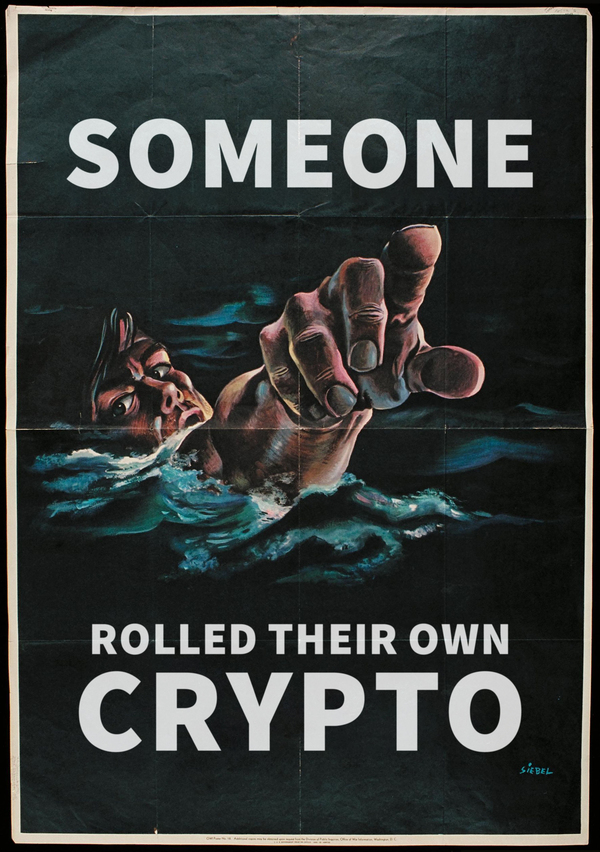
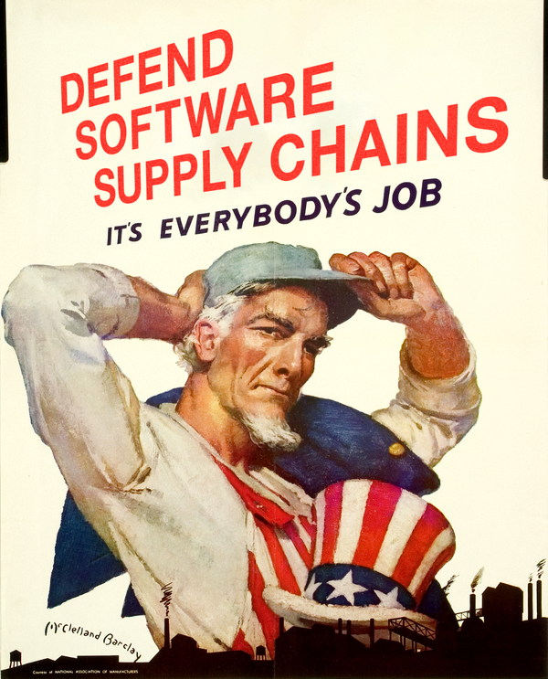
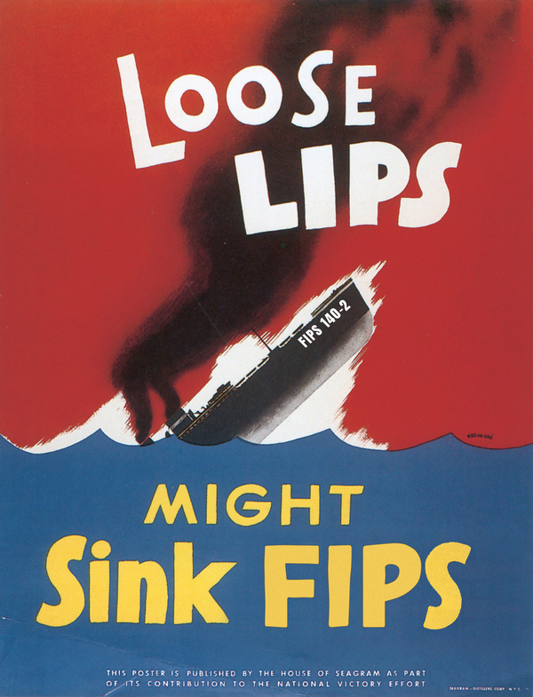

# Security Posters
A few Crypto and Software Security related posters derived from classic WWI Propaganda Posters

# A Note on Use

In the case of `crypto` and `loose_lips` posters these are derived works of public domain posters. In the case of `defend` this is a derived work with the permission of the National Association of Manufacturers. 
 
All works are licensed under [CC BY-NC-SA](https://creativecommons.org/licenses/by-nc-sa/4.0/)

## You are free to:

*Share* — copy and redistribute the material in any medium or format

*Adapt* — remix, transform, and build upon the material

The licensor cannot revoke these freedoms as long as you follow the license terms.

## Under the following terms:

*Attribution* — You must give appropriate credit, provide a link to the license, and indicate if changes were made. You may do so in any reasonable manner, but not in any way that suggests the licensor endorses you or your use.

*NonCommercial* — You may not use the material for commercial purposes.

*ShareAlike* — If you remix, transform, or build upon the material, you must distribute your contributions under the same license as the original.

No additional restrictions — You may not apply legal terms or technological measures that legally restrict others from doing anything the license permits.

 This work is licensed under a <a rel="license" href="http://creativecommons.org/licenses/by-nc-sa/4.0/">Creative Commons Attribution-NonCommercial-ShareAlike 4.0 International License</a>.
